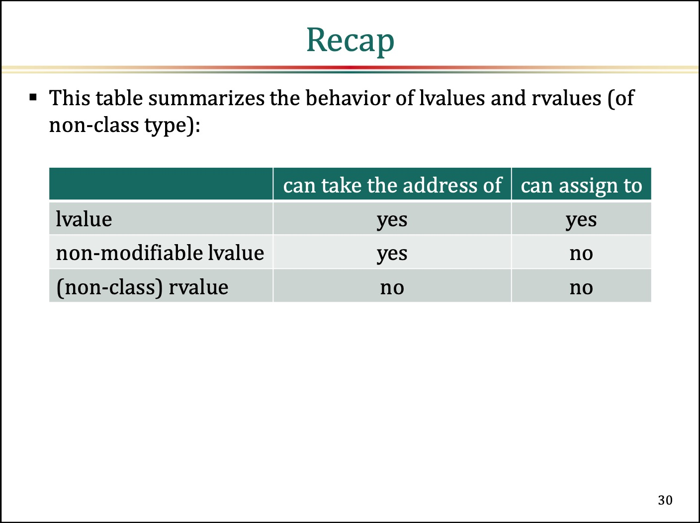
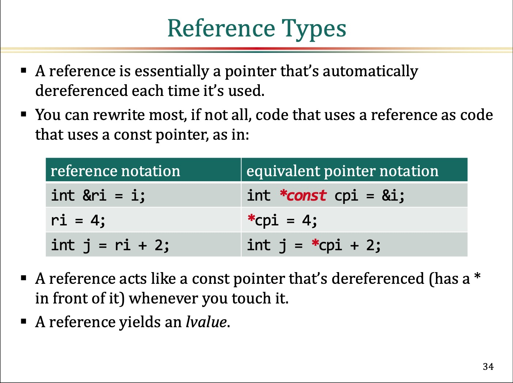

# Understanding Lvalues and Rvalues
This is my learning notes of [Core C++ 2019 :: Dan Saks :: Understanding Lvalues and Rvalues](https://www.youtube.com/watch?v=mK0r21-djk8).     
This is an excellent guide to help us understanding more details of Lvalues and Rvalues.    

## Notes
I'd like to summary the most important stuff for me here. Any other details can be deep dive into the [video](https://www.youtube.com/watch?v=mK0r21-djk8)/[slides](https://corecppil.github.io/CoreCpp2019/Presentations/Dan_Saks_Lvalues_and_Rvalues.pdf).    

### Recap for Lvalues and Rvalues
This is a perfect summary of Lvalue and Rvalue behaviors. Refer to [understanding-cpp11/rvalue_reference](../../understanding-cpp11#rvalue_reference) also.    

### Reference Types
**A reference is essentially a pointer(acts like a const pointer)** that's **automatically dereferenced**  each time it's used.     
It gives much sense to me for where the **reference** comes from.    

### Value Categories
Values categories in modern `C++`. Refer to [understanding-cpp11/rvalue_reference](../../understanding-cpp11#rvalue_reference) also.    

## References
- [Core C++ 2019 :: Dan Saks :: Understanding Lvalues and Rvalues](https://www.youtube.com/watch?v=mK0r21-djk8)
  - [Slides](https://corecppil.github.io/CoreCpp2019/Presentations/Dan_Saks_Lvalues_and_Rvalues.pdf)